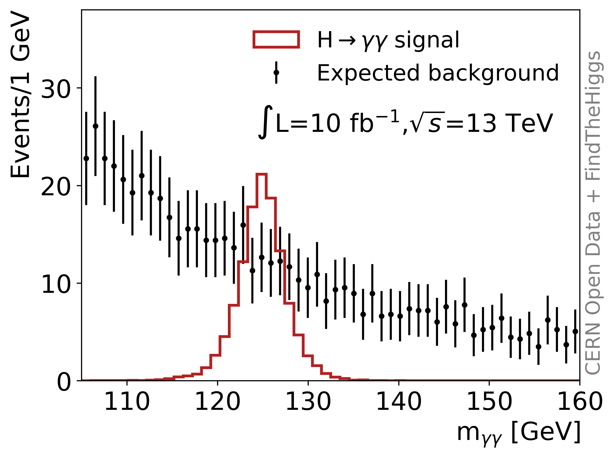

Finding the Higgs with Machine Learning

Ntuple source: https://opendata.cern.ch/record/15006

Use like:

   1. BDT train and predict: 
```
# train bdt & run predictions 
python bdt.py

- example signal and background .csv files are in inputs/ directory
- full statistics signal and background .csv files can be obtained from CERN Open Data, using FindTheHiggs/NtupleProcessing code.

```


   2. Analyse the results of step 1: 
```
python bdt_ana.py
```

Example plot:

<div align="center">
     
</div>


